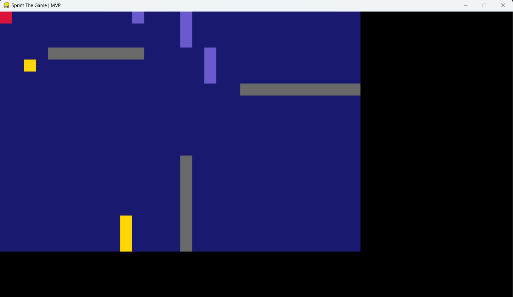
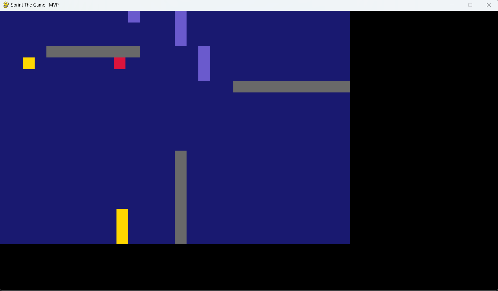
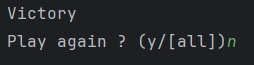

# CodingWeeks2-jeeth (Juliette, Emmanuel, Enzo, Thomas, Henrik)

For this second week, we wanted to create a puzzle-type game, based on two games that we really enjoy.

The goal is simple: it consists of a grid and one or more characters controlled simultaneously by the user.

A character is:

- represented by a square that moves within the grid
- of a color that can change during the game

The grid contains:

- a set of walls of different colors
- a starting point for each character
- a destination point assigned to each character
- 'color switchers' that allow changing the player's color when the player passes over them

The user's objective is to position all the characters on their destination point, knowing that a character can move through walls of its color.

This is the MVP achieved as part of the coding weeks at CentraleSupélec.




## Getting started

Would you like to test this MVP? Here's what you need to do:

- Clone this branch from our repository to your computer:

```
git clone -b MVP-demo https://gitlab-student.centralesupelec.fr/enzo.le-van/codingweeks2-jeeth.git
```

- The game has been developed under Python 3.11.5, but it should be compatible with any version of Python >3.11 on both MacOS and Windows. Therefore, make sure you have such a version with the following command. If not, you can download and update your Python using the following link:

```
python --version
(or python3 --version)
```

https://www.python.org/downloads/release/python-3115/

- Next, you need to install the libraries used in this project, which are two in number and specified in the 'requirements.txt' file. However, to avoid compromising your global Python installation, we suggest working with a virtual environment. This means having a separate Python and pip integrated directly into the project. Open a terminal in the cloned folder:

```
python -m venv venv

.\venv\Scripts\pip install -r requirements.txt
```

- You can then launch the game by executing:

```
.\venv\Scripts\python main.py
```

- A black Pygame window will then open, and the terminal will prompt you to select the level number you want to play. For now, there's only the '0' level, so enter '0'.


- You can then move using the LEFT, RIGHT, UP, DOWN keys on the keyboard. You control the small red square in the top-left corner of the screen, and your goal is to reach the point at the bottom-right of the grid by moving.



- There are two color switchers in this level, shown here:


- Upon your victory, you will be asked to respond in the terminal:



## Note to the user

We would like to inform you that if you have followed the installation steps, you now have a Python environment in your folder with only the numpy and pygame libraries. The folder can be heavy.

This is an MVP, and here are the points for improvement for the final product:

- The character is not easily recognizable.
- The character is too slow.
- The color switchers are not easily recognizable.
- The starting point is not marked on the grid, and while it's not vital, marking the destination point is necessary.
- The grid is not centered in the window.
- An graphical interface is needed to select a level or retry the level, not in a terminal.
- The game is too static: nothing moves, and there are no special effects.

All these points of improvement have been addressed, and you can find them in the main branch:

https://gitlab-student.centralesupelec.fr/enzo.le-van/codingweeks2-jeeth
